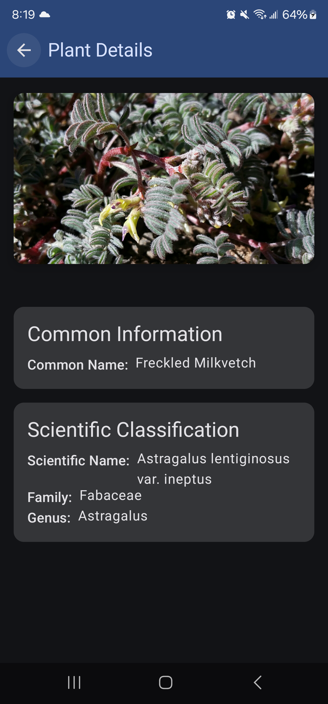
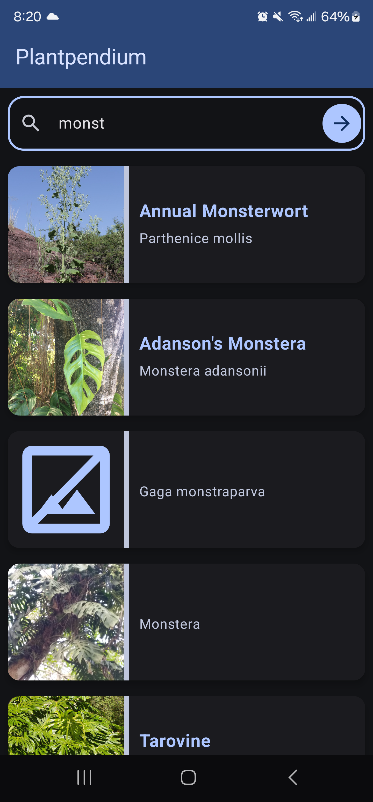
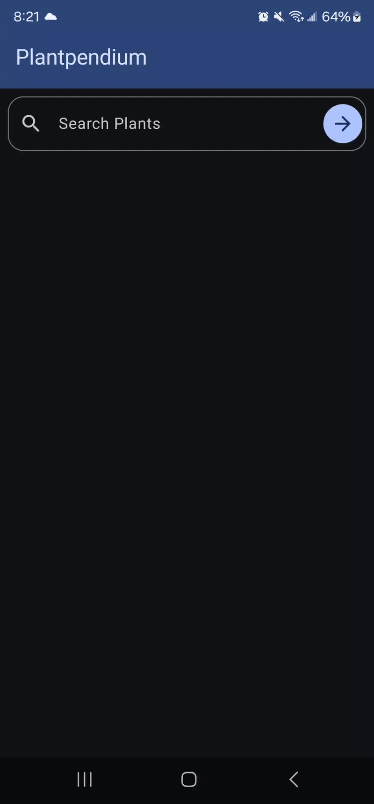

# Plantpendium

## About
Plantpendium FloraCodex API App, in Jetpack Compose.

## Features
**Integration with the FloraCodex API to search, and view plant details.

## Screenshots
### Search Functionality

## Usage

## FloraCodex
For more in-depth botanical information, you can also visit [FloraCodex.com](https://floracodex.com).